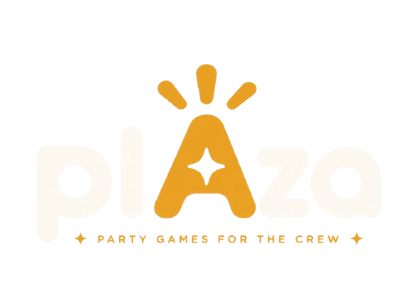

<div align="center">



# Plaza

**Party-games launchpad for the crew.** Mobile-first hub, isolated game modules, server-authoritative state.

[](https://plaza-games.vercel.app)
[](#license)

<br />

[](https://nextjs.org)
[](https://react.dev)
[](https://typescriptlang.org)
[](https://tailwindcss.com)
[](https://supabase.com)
[](https://orm.drizzle.team)
[](https://vercel.com)
[](https://pnpm.io)

</div>

---

## ✨ What it is

Plaza is a small, mobile-first launchpad for party games you play with friends in one room (or on a call). One person creates a room, everyone joins with a 4-character code, and you pick a game from the catalog. Each game is its own self-contained module — a broken game can't break the hub or any other game.

> **Working title.** "Lobby" was the original name; "Plaza" is the current direction.

## 🎮 Games

| Game | What it is | Status |
| --- | --- | --- |
| **Imposteri** | One player is the impostor. The crew sees a secret word, the impostor sees only the category + a subtle hint. Clues are said out loud at the table, then the room votes in 10s. | ✅ Playable |
| **Gradovi i Sela** | A letter drops, race to fill the categories (grad / selo / zemlja / ime / životinja / biljka / predmet). Optional Gemini-backed validator for the long tail of valid proper-nouns. | ✅ Playable |
| **Asocijacije** | Four columns of hidden associations leading to a final solution. Server holds every answer until reveal. | 🔜 Scaffolded |
| **Guess the Song** | Host connects Spotify, picks a playlist, the room hears a 30s clip per round (iTunes preview), first correct title wins. | 🔜 Scaffolded |

## 🚀 Live

Production: **[plaza-games.vercel.app](https://plaza-games.vercel.app)** — main branch auto-deploys to production, every push gets a Preview URL.

## 🧱 Stack

- **Framework** — [Next.js 16](https://nextjs.org) App Router, [React 19](https://react.dev), [TypeScript](https://typescriptlang.org) strict
- **Styling** — [Tailwind CSS v4](https://tailwindcss.com) + a small `plaza-*` utility layer in [`app/globals.css`](./app/globals.css)
- **Data** — [Supabase](https://supabase.com) Postgres + Realtime + anonymous auth; [Drizzle ORM](https://orm.drizzle.team) owns schema and migrations
- **Realtime** — Supabase Broadcast channels (`room:<CODE>`) for game events, Presence for the player roster
- **Music** — [Spotify](https://developer.spotify.com) (host OAuth, metadata) + [iTunes Search API](https://developer.apple.com/library/archive/documentation/AudioVideo/Conceptual/iTuneSearchAPI/) for the 30s preview clip
- **AI (optional)** — [Google Gemini](https://ai.google.dev) for Gradovi long-tail validation
- **Hosting** — [Vercel](https://vercel.com)
- **Tooling** — [pnpm](https://pnpm.io), Node 20+

## ⚡ Quickstart

```bash
pnpm install
cp .env.example .env.local        # fill in Supabase + Spotify (+ Gemini) keys
pnpm db:generate                  # generate migration from schema
pnpm db:migrate                   # apply to Supabase Postgres
pnpm dev                          # http://localhost:3000
```

### Scripts

```bash
pnpm dev          # next dev (Turbopack)
pnpm build        # next build
pnpm lint         # eslint
pnpm typecheck    # tsc --noEmit
pnpm db:generate  # drizzle-kit generate (new migration from schema)
pnpm db:migrate   # drizzle-kit migrate (apply pending migrations)
pnpm db:studio    # drizzle-kit studio (browse DB)
```

## 🗂️ Layout

```
app/                       # routes (App Router)
  page.tsx                 # hub: landing + create / join
  play/[room]/             # room shell — lobby, presence, header
  play/[room]/[game]/      # game route — mounts the registered module
  api/rooms/[room]/        # intent, state, finish, gradovi-ai
features/                  # game modules — one folder per game
  registry.ts              # GameModule contract + catalog meta
  index.ts                 # id -> module lookup
  <game>/
    types.ts               # state, intents, redacted view
    module.ts              # GameModule implementation
    client.tsx             # client UI
lib/
  db/                      # drizzle schema, client, migrations
  supabase/                # browser / server clients + proxy middleware
  realtime/                # supabase realtime wrapper (channel helpers)
  rooms/                   # room code gen + lifecycle
  music/                   # spotify + itunes (provider interface)
components/                # shared ui (forms, preferences, ...)
public/                    # plaza brand + favicon
```

## 🧩 How games plug in

A new game is a folder under `features/<id>/` that:

1. Implements the [`GameModule`](./features/registry.ts) interface (`initialState`, `reduce`, `redact`, `ClientComponent`).
2. Registers itself in [`features/index.ts`](./features/index.ts) and adds the id to `GAME_IDS` in [`lib/db/schema.ts`](./lib/db/schema.ts).
3. Adds a `GameMeta` entry to the catalog in [`features/registry.ts`](./features/registry.ts).

The hub and room shell stay untouched. That's the whole contract.

## 🔒 Server authority & redaction

The server is the **only** writer of authoritative game state. The flow:

```
client  ──intent──▶  /api/rooms/[room]/intent  ──┐
                                                 │  validate + reduce
                                                 ▼
                                            postgres (jsonb state)
                                                 │
                                                 ▼  broadcast {gameId, updatedAt}
client  ◀──refetch redacted view──   /api/rooms/[room]/state
```

Realtime payloads carry **only** invalidation events (`{ gameId, updatedAt }`). Each client refetches its own redacted view — so secrets like the Imposteri role map, the impostor's hint, or Gradovi answers during the writing phase never leak through the broadcast.

> **Vercel serverless can't hold WebSockets.** Realtime runs through Supabase Broadcast — don't try to open a long-lived `ws://` from a route handler.

## 🔑 Environment

See [`.env.example`](./.env.example). Required:

```bash
NEXT_PUBLIC_SUPABASE_URL=
NEXT_PUBLIC_SUPABASE_ANON_KEY=
SUPABASE_SERVICE_ROLE_KEY=
DATABASE_URL=                     # supabase pooler url, used by drizzle

SPOTIFY_CLIENT_ID=                # guess the song (host-only oauth)
SPOTIFY_CLIENT_SECRET=
SPOTIFY_REDIRECT_URI=

GEMINI_API_KEY=                   # optional — gradovi ai validation
GEMINI_MODEL=gemini-2.5-flash
```

Three environments: **local** → **Vercel Preview** (per-branch) → **Production**.

## 📜 License

MIT — do whatever, just don't blame me if your friends start arguing over a Gradovi answer.

<br />

<div align="center">

Made with care for the crew. 🫶

</div>
